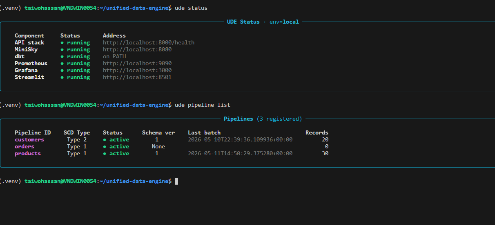
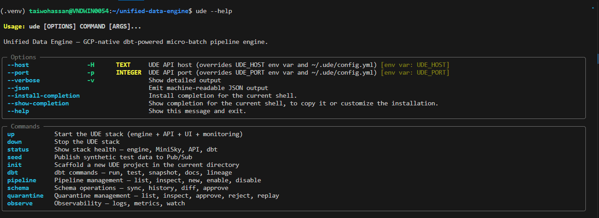
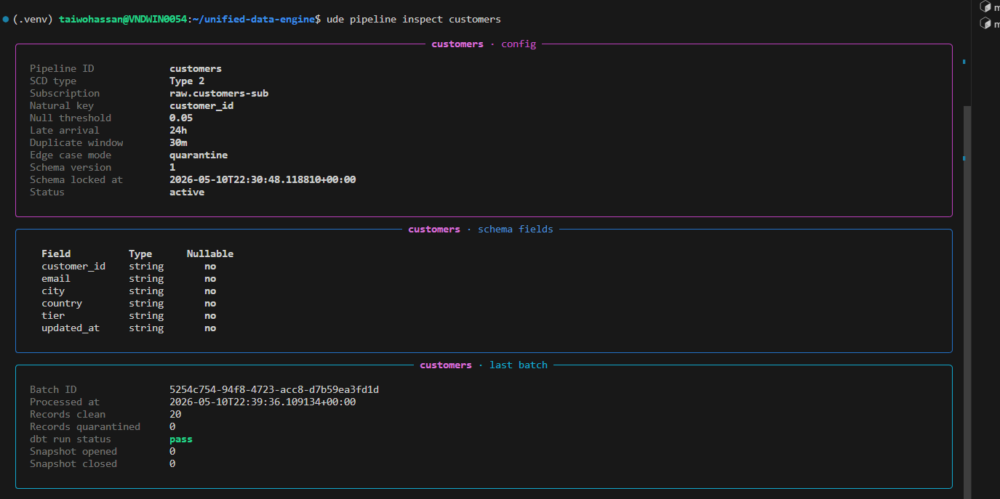
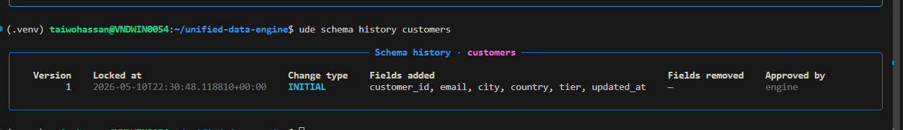
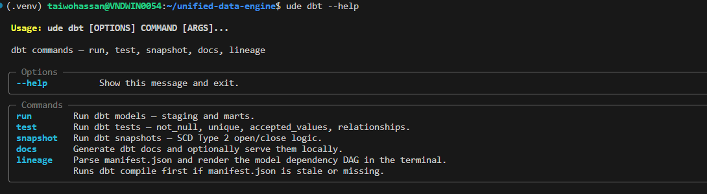
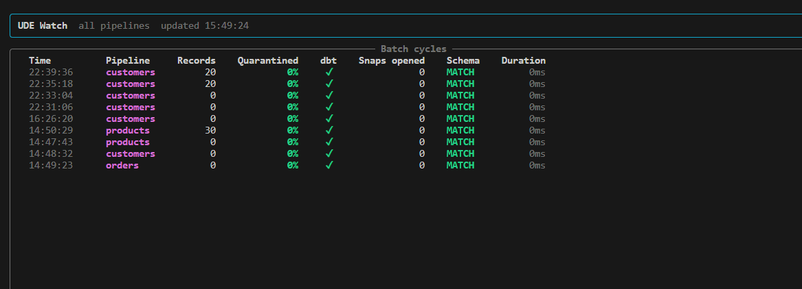
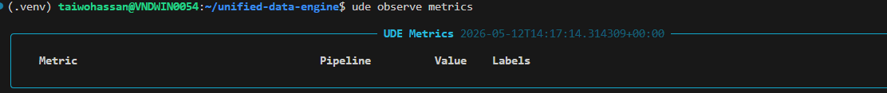
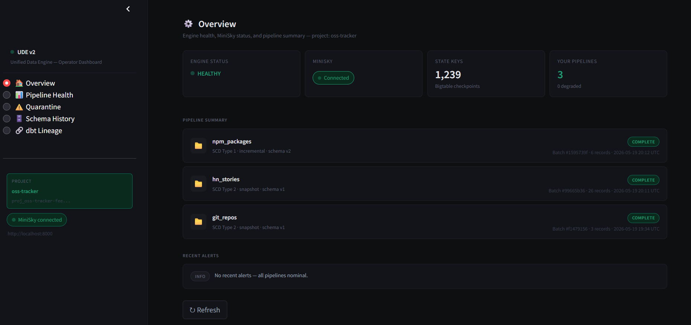
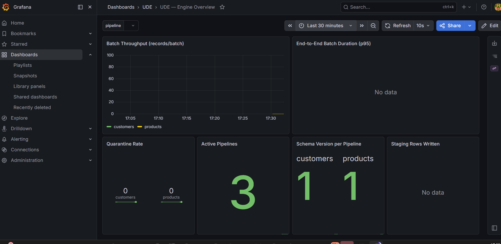
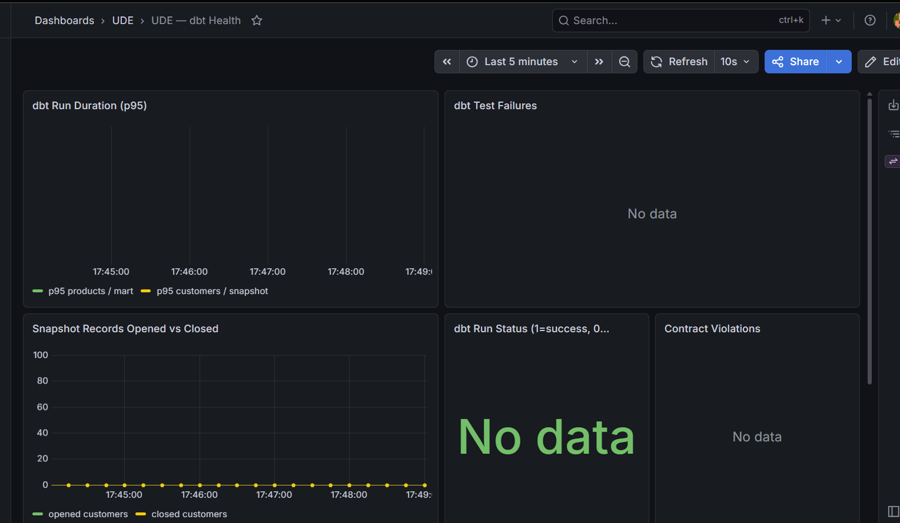

# Unified Data Engine

A cloud-native, GCP-first, dbt-powered micro-batch data pipeline engine with a full operator CLI.

```bash
pip install unified-data-engine
ude auth signup
ude up
```

---

## What It Does

UDE is a self-contained data processing platform for platform data engineers who need production-grade SCD handling, schema drift detection, and full observability — without the overhead of enterprise-scale tools.

**The core promise:** register a pipeline via `ude pipeline new`, push data via HTTP or Pub/Sub, and the engine handles everything else — schema inference, edge case gating, dbt transformations, checkpointing, and metrics.

### What happens on every 30-second batch cycle:

```
Cloud Pub/Sub  ─or─  POST /pipeline/{id}/ingest
        ↓
   Pull messages (30s window)
        ↓
   Schema check → MATCH / EVOLVED / BROKEN
        ↓
   Edge case gate → null check, dedup, type validation, late arrival
        ↓
   Write clean records → BigQuery raw_staging
        ↓
   dbt run → snapshot (SCD Type 2) → mart (SCD Type 1) → tests
        ↓
   Checkpoint + ack  ← only after all dbt tests pass
        ↓
   Push metrics → Prometheus → Grafana
```

Failed batches are nacked and reprocessed automatically on the next cycle.

---

## Pipelines Proven End to End

| Pipeline | SCD Type | Natural Key | Records/batch |
|---|---|---|---|
| customers | Type 2 (full history via snapshot) | customer_id | 20 |
| orders | Type 1 (overwrite) | order_id | 200 |
| products | Type 1 (overwrite) | product_id | 30 |

Adding a new pipeline = `ude pipeline new`. Zero engine code changes.

---

## Stack

| Component | Technology | Role |
|---|---|---|
| Message bus | Cloud Pub/Sub | Ingestion, micro-batch rhythm |
| Direct ingest | FastAPI `/ingest` | HTTP push — no Pub/Sub client needed |
| Transformation | dbt Core | SCD via snapshots + incremental |
| Dev adapter | dbt-duckdb | Zero-config local development |
| Prod adapter | dbt-bigquery | Production GCP target |
| Batch processing | Polars | Schema inference, edge case validation |
| Hot state | Bigtable (local: JSON files) | Schema versions, offsets, checkpoints |
| Target store | BigQuery | Staging, snapshots, marts, quarantine |
| API | FastAPI | Control plane — 20+ REST endpoints |
| Auth | Bearer tokens + Bigtable | Self-service API keys, 90-day TTL |
| CLI | Typer + Rich | `ude` — operator CLI, pip-installable |
| Dashboard | Streamlit | Operator UI — 5 pages |
| Metrics | Prometheus + Pushgateway | Engine + dbt metrics pipeline |
| Dashboards | Grafana | 2 live dashboards (auto-provisioned) |
| Local GCP | MiniSky | Emulates all GCP services locally |
| Infra-as-code | Terraform | Provisions MiniSky + real GCP |

Cloud-native, GCP-first. AWS and self-hosted providers on the roadmap.

---

## Prerequisites

- WSL2 / Ubuntu 24.04 (or macOS/Linux)
- Docker Desktop with WSL2 backend enabled
- Python 3.12+
- MiniSky (local GCP emulator)

---

## Installation

### Option A — pipx (recommended for CLI-only use)

```bash
pipx install unified-data-engine
ude --version
```

### Option B — pip in a virtual environment

```bash
python3 -m venv .venv
source .venv/bin/activate
pip install unified-data-engine
```

### Option C — uv

```bash
uv tool install unified-data-engine
```

> **Note:** On modern Debian/Ubuntu, `pip install` outside a venv fails with an
> "externally-managed-environment" error. Use pipx, uv, or a venv.

---

## Engine Setup (contributors + self-hosted GCP)

```bash
# 1. Install MiniSky (local GCP emulator)
curl -sSL https://minisky.bmics.com.ng/install.sh | sh

# 2. Clone and install
git clone https://github.com/tycoach/unified-data-engine
cd unified-data-engine
python3 -m venv .venv
source .venv/bin/activate
pip install -e ".[dev]"

# 3. Create your account
ude auth signup

# 4. Start everything — one command
ude up
```

`ude up` handles the full startup sequence automatically:

```
  [1/6] MiniSky          ✓ ready at :8080
  [2/6] Provisioning     ✓ 6 topics · 6 subscriptions · 4 datasets
  [3/6] dbt packages     ✓ already installed — skipping
  [4/6] FastAPI          ✓ ready at :8000
  [5/6] Streamlit UI     ✓ ready at :8501
  [6/6] Monitoring       ✓ Grafana at :3000

  ✓ UDE stack is up.
```

No `make`. No separate provision script. No separate `docker compose up`.

---

## Verify

```bash
ude status
```



---

## Authentication

UDE uses self-service API keys. Every CLI command and API call requires a valid Bearer token.

```bash
# Create an account — get your API key
ude auth signup --email you@company.com --project my-project

# Your key is saved to ~/.ude/config.yml automatically
# It is shown once — store it securely
```

Public endpoints (no auth required): `GET /`, `GET /health`, `POST /auth/signup`, `GET /metrics`

Everything else requires: `Authorization: Bearer ude_live_<key>`

### Auth commands

```bash
ude auth signup          # Create account, get API key
ude auth whoami          # Show identity + key expiry
ude auth rotate          # Rotate key — old key invalidated immediately
ude auth revoke          # Revoke key permanently
ude auth list-keys       # List all accounts (engine owner only)
ude auth audit           # View API audit log
ude auth audit --watch   # Live stream audit log (Ctrl+C to stop)
ude auth email-config    # Configure Gmail SMTP for expiry notifications
ude auth webhook-config  # Configure webhook for suspicious activity alerts
```

### Key expiry

API keys expire after **90 days**. You will receive an email warning 14 days before expiry if SMTP is configured. `ude auth whoami` shows days remaining.

```bash
# Set up expiry email notifications
ude auth email-config --email you@gmail.com --test

# Rotate before expiry (resets TTL to 90 days)
ude auth rotate
```

### Engine owner

The engine owner has full visibility across all projects. Set in `~/.ude/config.yml`:

```yaml
api_key: ude_live_...
project_token: __engine__
```

---

## The CLI — `ude`

The `ude` CLI ships with `pip install unified-data-engine`.



### Lifecycle

```bash
ude up                        # Start the full stack — one command
ude down                      # Stop all components
ude status                    # Health of all 6 components
ude seed                      # Publish synthetic test data to Pub/Sub
ude init                      # Scaffold a new project + generate project token
ude --version                 # Show installed version
```

### Pipeline management

```bash
ude pipeline list             # All pipelines — status, schema version, last batch
ude pipeline inspect <id>     # Full config, schema fields, last batch detail
ude pipeline new              # Interactive scaffold + register with engine
ude pipeline register <id>    # Register an existing local YAML with the engine
ude pipeline delete  <id>     # Deregister a pipeline
ude pipeline enable  <id>     # Resume a paused pipeline
ude pipeline disable <id>     # Pause without deleting
```



### Schema operations

```bash
ude schema show    <id>       # Inspect locked schema — fields, types, constraints
ude schema history <id>       # Version timeline — INITIAL → EVOLVED → BROKEN
ude schema diff    <id>       # Locked schema vs what's arriving live
ude schema sync               # Regenerate dbt contracts from registry
ude schema approve <id>       # Approve a BROKEN migration, unblock pipeline
```



### Quarantine management

```bash
ude quarantine list                   # All quarantined batches
ude quarantine inspect <batch_id>     # Full detail + schema diff + records
ude quarantine approve <batch_id>     # Release for replay
ude quarantine reject  <batch_id>     # Discard permanently
ude quarantine replay  <batch_id>     # Force immediate replay
```

### dbt commands

```bash
ude dbt run                   # Run all dbt models
ude dbt test                  # Run dbt tests
ude dbt snapshot              # Run dbt snapshots (SCD Type 2)
ude dbt docs                  # Generate + serve dbt docs
ude dbt lineage               # Render model dependency DAG in terminal
```



### Observability

```bash
ude observe start             # Start Prometheus + Pushgateway + Grafana (Docker)
ude observe stop              # Stop the monitoring stack
ude observe watch             # Live batch feed — records, dbt, schema, quarantine rate
ude observe logs              # Stream engine logs (filter by pipeline, level)
ude observe metrics           # Prometheus metrics snapshot as a Rich table
```





---

## Project Tokens — Multi-Tenant Isolation

`ude auth signup` generates a project token saved to `~/.ude/config.yml`. Every CLI command sends this token as `X-UDE-Project` on every API call.

**What this means:**
- `ude pipeline list` only shows pipelines you registered — never the engine owner's internal pipelines
- Engine-internal filesystem pipelines are never exposed to external callers
- Two users with different tokens are fully isolated from each other
- Share your token with teammates who need access to the same project

```yaml
# ~/.ude/config.yml
host: <engine-host>
port: 8000
api_key: ude_live_...
project_token: proj_acme-analytics-a3f9b2
project_name: acme-analytics
email: you@company.com
```

Override via env var:
```bash
export UDE_API_KEY=ude_live_...
export UDE_PROJECT_TOKEN=proj_acme-analytics-a3f9b2
```

---

## Fresh Install — 3rd Party User

```bash
# 1. Install
pipx install unified-data-engine

# 2. Create your account
ude auth signup --email you@company.com --project my-project

# 3. Configure engine host
# Edit ~/.ude/config.yml:
#   host: <engine-host>
#   port: 8000 (or 8443 for HTTPS)

# 4. Start your local monitoring stack
ude observe start

# 5. Register your first pipeline
ude pipeline new

# 6. Push data — no Pub/Sub client needed
curl -X POST https://<engine-host>:8443/pipeline/events/ingest \
  -H "Authorization: Bearer ude_live_..." \
  -H "X-UDE-Project: proj_my-project-abc123" \
  -H "Content-Type: application/json" \
  -d '{"records": [{"event_id": "e1", "user_id": "u1", ...}]}'

# 7. Watch it process
ude observe watch
```

---

## Sending Data — Two Paths

### Path A — Direct HTTP ingest (recommended for 3rd party users)

No Pub/Sub SDK. No topic management. One HTTP POST.

```bash
POST /pipeline/{pipeline_id}/ingest
Authorization: Bearer ude_live_...
X-UDE-Project: proj_acme-analytics-a3f9b2
Content-Type: application/json

{
  "records": [
    {"event_id": "e1", "user_id": "u1", "event_type": "click", "created_at": "2026-05-20T12:00:00"},
    {"event_id": "e2", "user_id": "u2", "event_type": "view",  "created_at": "2026-05-20T12:00:01"}
  ]
}
```

From Python:

```python
import requests

requests.post(
    "https://your-engine-host:8443/pipeline/events/ingest",
    headers={
        "Authorization": "Bearer ude_live_...",
        "X-UDE-Project":  "proj_acme-analytics-a3f9b2",
    },
    json={"records": your_records}
)
```

Supports up to 10,000 records per call. Processed on the next 30-second cycle.

### Path B — Pub/Sub publish (existing GCP pipelines)

Publish directly to the pipeline's Pub/Sub topic if you already have a Pub/Sub client.

---

## Registering a New Pipeline

### Option A — Interactive CLI (recommended)

```bash
ude pipeline new
```

Scaffolds and registers in one shot. Engine picks it up on the next cycle — no restart needed.

### Option B — Manual YAML + register

```yaml
# config/pipelines/events.yml
pipeline_id: events
subscription_id: raw.events-sub
natural_key: event_id
scd_type: 1
edge_case_mode: quarantine
null_threshold: 0.02
late_arrival_window: 24h
duplicate_window: 30m

fields:
  event_id:   { type: string,   nullable: false }
  user_id:    { type: string,   nullable: false }
  event_type: { type: string,   nullable: false }
  created_at: { type: datetime, nullable: false }
```

```bash
ude pipeline register events
```

---

## Schema Operations

```bash
ude schema show git_repos
```

```
╭──────────────── git_repos · locked schema ─────────────────╮
│  Pipeline    git_repos                                      │
│  Version     v1                                             │
│  Locked at   2026-05-15T23:02:17+00:00                      │
│  Fields      5                                              │
╰─────────────────────────────────────────────────────────────╯
╭──────────────── git_repos · fields ────────────────────────╮
│  Field        Type       Nullable                           │
│  repo_id      string     no                                 │
│  name         string     no                                 │
│  stars        integer    yes                                │
│  language     string     yes                                │
│  updated_at   datetime   no                                 │
╰─────────────────────────────────────────────────────────────╯
```

### Schema Deviation Handling

| Outcome | What happened | Engine action |
|---|---|---|
| **MATCH** | Schema identical | Fast path — continue |
| **EVOLVED** | New column added, type widened | Update registry, regenerate dbt contract, continue |
| **BROKEN** | Column removed, type incompatible | Quarantine batch, alert operator, hold schema |

```bash
ude schema diff    customers   # Preview what changed
ude schema approve customers   # Approve + unblock pipeline
```

---

## Security

### API key authentication

All endpoints (except `/`, `/health`, `/auth/signup`, `/metrics`) require:
```
Authorization: Bearer ude_live_<key>
```

### Rate limiting

Signup is limited to 5 attempts per IP per hour. Excessive requests return `429 Too Many Requests`.

### Key expiry

All API keys expire after 90 days. The engine sends email warnings 14 days before expiry if SMTP is configured.

### Audit logging

Every authenticated request is written to the audit log. View with:

```bash
ude auth audit --limit 20
ude auth audit --watch          # live stream
ude auth audit --email user@x   # filter by user (engine owner only)
```

### Suspicious activity detection

The engine detects when the same API key is used from two different IP addresses within 60 seconds and fires a webhook alert. Configure with:

```bash
ude auth webhook-config --url https://hooks.slack.com/... --test
```

### HTTPS (local dev)

```bash
python3 scripts/setup_https.py
# Generates ~/.ude/tls/server.crt and server.key via openssl
# Updates ~/.ude/config.yml with use_https: true, port: 8443
# ude up auto-detects and starts API with TLS
```

For production, place UDE behind a reverse proxy (nginx, Caddy) with a CA-signed certificate.

---

## Operator Dashboard

Five pages at `http://localhost:8501`:

| Page | What it shows |
|---|---|
| **Overview** | Engine health, MiniSky status, pipeline summary |
| **Pipeline Health** | Checkpoint history, batch stats, schema fields |
| **Quarantine** | Dirty records with failure reasons, migration approval |
| **Schema History** | Locked schemas, version timeline, dbt source contracts |
| **dbt Lineage** | Model dependency DAG from manifest.json |

---

## API — Control Plane



FastAPI at `http://localhost:8000/docs` — 20+ endpoints across 7 routers.

| Router | Key endpoints |
|---|---|
| `/auth` | signup, whoami, rotate, revoke, list-keys, audit |
| `/health` | Stack health, MiniSky connectivity |
| `/pipeline` | List, inspect, register, enable/disable, ingest, batch history |
| `/schema` | Show, history, diff, sync, approve migration |
| `/quarantine` | List batches, inspect, approve, reject, replay |
| `/dbt` | Trigger runs, status, lineage, artifacts |
| `/metrics/structured` | JSON metrics scraped from Pushgateway |
| `/logs/stream` | NDJSON log stream for `ude observe logs` |

All endpoints are scoped to `X-UDE-Project` — external callers only see their own pipelines.

---

## Monitoring & Alerting

```bash
ude observe start   # starts Prometheus + Pushgateway + Grafana via Docker
```





Both Grafana dashboards are provisioned automatically on `ude up` — no manual import needed.

Prometheus scrapes `http://localhost:8000/metrics` + Pushgateway at `:9091`.

### Key metrics

| Metric | What it tracks |
|---|---|
| `ude_batch_records_total` | Records pulled per batch |
| `ude_quarantine_rate` | Quarantine rate (0.0–1.0) |
| `ude_schema_deviation_total` | MATCH / EVOLVED / BROKEN counts |
| `ude_dbt_run_duration_seconds` | dbt run time histogram |
| `ude_dbt_test_failures_total` | Test failures — each blocks checkpoint |
| `ude_snapshot_records_opened_total` | SCD Type 2 changes per batch |
| `ude_dbt_run_status` | Last dbt run: 1=success, 0=failure |
| `ude_checkpoints_total` | Successful vs failed checkpoints |

### Alert rules (7 total)

| Alert | Condition | Severity |
|---|---|---|
| HighQuarantineRate | quarantine_rate > 10% | Critical |
| DbtTestFailure | any not_null or unique failure | Critical |
| SchemaDeviationDetected | BROKEN deviation | Critical |
| SnapshotMismatch | opened != closed | Critical |
| SlowBatchProcessing | p95 > 60s | Warning |
| DbtRunExceedsWindow | p95 > 25s | Warning |
| ZeroRowsProcessed | 0 rows for 3 batches | Warning |

---

## MiniSky — Important Notes

MiniSky loses all Pub/Sub and BigQuery state on restart. Simply run:

```bash
ude up
```

`ude up` automatically re-provisions all topics and subscriptions for every registered pipeline on every startup. No manual `make provision` needed.

---

## Deploying to Real GCP

No engine code changes needed:

1. Set `GOOGLE_APPLICATION_CREDENTIALS` to your service account key
2. Update `config/engine.yml` → `environment: production`
3. Update `dbt/profiles.yml` → `target: prod`
4. Run `terraform apply` in `terraform/`
5. For HTTPS: place UDE behind nginx or Caddy with a CA-signed cert

---

## Project Structure

```
unified-data-engine/
├── config/
│   ├── engine.yml              Global engine settings
│   ├── loader.py               Pipeline loader — filesystem + Bigtable
│   └── pipelines/              One YAML per pipeline (engine-internal)
├── engine/
│   ├── main.py                 Micro-batch loop (hot-reloads per cycle)
│   ├── ingestion/              Pub/Sub consumer + offset manager
│   ├── schema/                 Inference, registry, deviation, contract writer
│   ├── staging/                Edge case gate + BigQuery staging writer
│   ├── dbt_runner/             dbt orchestration + results parser
│   ├── state/                  Bigtable client + checkpoint manager
│   ├── metrics/                Prometheus metric emitters
│   └── notifications/          Email expiry warnings + webhook alerts
├── dbt/
│   ├── models/staging/         One view per dataset
│   ├── models/marts/           SCD Type 1 incremental models
│   └── snapshots/              SCD Type 2 snapshot declarations
├── api/
│   ├── middleware/auth.py      Bearer token validation + rate limiting
│   └── routers/                auth, health, pipeline, schema, quarantine, dbt
├── cli/                        ude CLI — Typer + Rich, pip-installable
│   ├── commands/               auth, lifecycle, dbt, pipeline, schema, quarantine, observe
│   ├── client/                 HTTP clients for all API routers
│   ├── data/dashboards/        Grafana JSON bundled in pip wheel
│   ├── scaffold/               ude init + ude pipeline new generators
│   └── core/                   Config, errors, checks, context
├── ui/                         Streamlit — 5 operator pages
├── monitoring/
│   ├── prometheus/             prometheus.yml + alerts.yml (7 rules)
│   └── grafana/dashboards/     engine_overview.json + dbt_health.json
├── scripts/
│   └── setup_https.py          Generate self-signed TLS cert via openssl
├── data-generator/scenarios/   happy_path.py, products.py
├── tests/
│   ├── unit/cli/               92 passing unit tests
│   └── integration/cli/        Integration test stubs
├── assets/                     CLI screenshots
├── pyproject.toml              Package manifest
├── Makefile                    Engine dev commands
└── .env.example
```

---

## Why UDE?

| Problem | UDE solution |
|---|---|
| Writing SCD MERGE SQL for every dataset | dbt snapshots + incremental — zero custom SQL |
| Schema changes breaking pipelines silently | MATCH / EVOLVED / BROKEN on every batch |
| Nulls, duplicates, late arrivals handled inconsistently | Edge case gate — configurable per pipeline |
| New pipeline takes days to set up | `ude pipeline new` — scaffold + register in 2 minutes |
| No visibility into what's happening | CLI + FastAPI + Streamlit + Prometheus + Grafana |
| Operator commands require SSH + curl | `ude quarantine approve`, `ude schema diff` from anywhere |
| 3rd party users can see internal pipelines | Project token scoping — full multi-tenant isolation |
| Startup requires 6 separate commands | `ude up` — one command, all 6 components |
| Getting data in requires a Pub/Sub client | `POST /pipeline/{id}/ingest` — plain HTTP, no SDK |
| API keys with no expiry or audit trail | 90-day TTL, audit log, expiry emails, webhook alerts |
| Vendor lock-in to expensive platforms | Cloud-native, GCP-first. AWS + self-hosted on roadmap. |

---

## Releases

| Version | PyPI | What shipped |
|---|---|---|
| `3.1.0` | ✓ latest | Email expiry notifications, `ude auth audit --watch`, suspicious activity webhook |
| `3.0.0` | ✓ | HTTPS, `ude auth list-keys`, `ude auth audit`, expiry warnings in whoami |
| `2.9.0` | ✓ | Rate limiting, key expiry (90-day TTL), audit logging, Grafana password |
| `2.8.0` | ✓ | API key authentication — self-service signup, Bearer tokens, project scoping |
| `2.7.2` | ✓ | Grafana dashboards auto-provisioned on `ude up`, Prometheus scrapes Pushgateway |
| `2.6.0` | ✓ | `ude up` one-command startup, auto-provision, context-aware for pip users |
| `2.0.0` | ✓ | Initial PyPI release — baseline engine + CLI |
| `1.6.0` | — | `ude up` full stack — no make required |
| `1.5.0` | — | Engine hot-reload + `ude observe start/stop` |
| `1.4.0` | — | Project token scoping — multi-tenant pipeline isolation |
| `1.2.0` | — | `POST /pipeline/` — register pipelines without filesystem access |
| `1.1.0` | — | FastAPI endpoints wired — full CLI to API round trip |
| `1.0.0-cli` | — | `ude` CLI complete — 92/92 unit tests, all 6 command groups |

---

## License

MIT — use it, fork it, build on it.

---

Built by [Taiwo Hassan](https://github.com/tycoach) · Powered by [MiniSky](https://github.com/qamarudeenm/minisky)